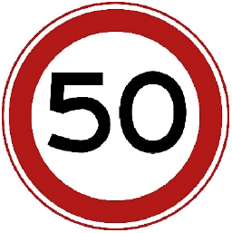
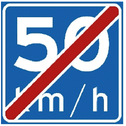
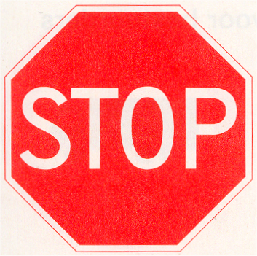
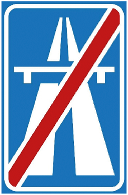

# Reglement verkeersregels en verkeerstekens 1990 (RVV 1990)

## Hoofdstuk I Begripsbepalingen

#### Artikel 1 RVV 1990 [Begripsbepaling]

In dit besluit en de daarop berustende bepalingen wordt verstaan onder:

- aanhangwagens: voertuigen die door een voertuig worden voortbewogen of kennelijk bestemd zijn om aldus te worden voortbewogen, alsmede opleggers;
- autosnelweg: weg, aangeduid door bord G1 van [bijlage I](#bijlage-1-rvv-1990-verkeersborden); langs autosnelwegen gelegen parkeerplaatsen en tankstations maken geen deel van de autosnelweg uit;
- autoweg: weg, aangeduid door bord G3 van [bijlage I](#bijlage-1-rvv-1990-verkeersborden); langs autowegen gelegen parkeerplaatsen en tankstations maken geen deel van de autoweg uit;
- bedrijfsauto: bedrijfsauto als bedoeld in artikel 1.1 van de Regeling voertuigen;
- bestelauto: motorvoertuig, bestemd voor het vervoer van goederen, waarvan de toegestane maximum massa niet meer bedraagt dan 3500 kg;
- bestuurders: alle weggebruikers behalve voetgangers;
- bestuurder van een motorvoertuig: hij die het motorvoertuig bestuurt;
- doorgaande rijbaan: rijbaan zonder de invoeg- en uitrijstroken;
- kruispunt: kruising of splitsing van wegen;
- motorfiets: motorvoertuig op twee wielen al dan niet met zijspan- of aanhangwagen;
- personenauto: personenauto als bedoeld in artikel 1.1 van de Regeling voertuigen;
- rijbaan: elk voor rijdende voertuigen bestemd weggedeelte.
- rijstrook: door doorgetrokken of onderbroken strepen gemarkeerd gedeelte van de rijbaan van zodanige breedte dat bestuurders van motorvoertuigen op meer dan twee wielen daarvan gebruik kunnen maken;

## Hoofdstuk II Verkeersregels

#### Artikel 3 RVV 1990 [Rechts houden]

1. Bestuurders zijn verplicht zoveel mogelijk rechts te houden.
2. Fietsers mogen met zijn tweeën naast elkaar rijden. Dit geldt niet voor snorfietsers.

#### Artikel 4 RVV 1990 [Voetgangers]

1. Voetgangers gebruiken het trottoir of het voetpad.
2. Zij gebruiken de berm of de uiterste zijde van de rijbaan, indien ook een fietspad of een fiets/bromfietspad ontbreekt.

#### Artikel 5 RVV 1990 [Fietsers]

1. Zij gebruiken de rijbaan indien een verplicht fietspad of een fiets/bromfietspad ontbreekt.
2. Zij mogen het onverplichte fietspad gebruiken. Bestuurders van snorfietsen uitgerust met een verbrandingsmotor mogen het onverplichte fietspad slechts gebruiken met uitgeschakelde motor.

#### Artikel 6 RVV 1990 [Bromfietsers]

1. Zij gebruiken de rijbaan indien een fiets/bromfietspad ontbreekt.

#### Artikel 11 RVV 1990 [Wijze van inhalen]

1. Inhalen geschiedt links.
2. Bestuurders die links voorgesorteerd hebben en te kennen hebben gegeven dat zij naar links willen afslaan, worden rechts ingehaald.
3. Fietsers dienen elkaar links in te halen; zij mogen andere bestuurders rechts inhalen.
4. Bestuurders die zich rechts van een blokmarkering bevinden mogen bestuurders die zich links van deze markering bevinden rechts inhalen.

#### Artikel 12 RVV 1990 [Verbod inhalen voor voetgangersoversteekplaats]

Het is verboden een voertuig vlak voor of op een voetgangersoversteekplaats in te halen.

#### Artikel 13 RVV 1990 [Plaats op de weg bij fileverkeer]

1. Bij fileverkeer behoeft, indien de rijbaan is verdeeld in rijstroken in dezelfde richting, niet de meest rechts gelegen rijstrook te worden gevolgd.
2. Files mogen aan de rechterzijde worden ingehaald.

#### Artikel 14 RVV 1990 [Verbod blokkeren kruispunt]

Bestuurders mogen een kruispunt niet blokkeren.

#### Artikel 15 RVV 1990 [Voorrang]

1. Op kruispunten verlenen bestuurders voorrang aan voor hen van rechts komende bestuurders.
2. Op deze regel gelden de volgende uitzonderingen:
    1. bestuurders op een onverharde weg verlenen voorrang aan bestuurders op een verharde weg;

#### Artikel 15a RVV 1990 [Gebruik overweg]

1. Weggebruikers mogen een overweg opgaan, indien zij direct kunnen doorgaan en de overweg geheel kunnen vrijmaken.
2. Bij overwegen laten weggebruikers een spoorvoertuig voorgaan en laten daarbij de overweg geheel vrij.

#### Artikel 16 RVV 1990 [Verbod doorsnijden militaire colonnes]

Weggebruikers mogen militaire colonnes en uitvaartstoeten van motorvoertuigen niet doorsnijden.

#### Artikel 17 RVV 1990 [Afslaan. Voorsorteren]

1. Bestuurders die willen afslaan, mogen voorsorteren door:
    1. indien zij naar rechts willen afslaan tijdig zoveel mogelijk aan de rechterzijde te gaan rijden;
    2. indien zij naar links willen afslaan tijdig zoveel mogelijk tegen de wegas te rijden of bij rijbanen bestemd voor bestuurders in één richting daarop zoveel mogelijk links te houden.
2. Bestuurders moeten alvorens af te slaan een teken met hun richtingaanwijzer of met hun arm geven.

#### Artikel 18 RVV 1990 [Voorrang bij afslaan]

1. Bestuurders die afslaan, moeten het verkeer dat hen op dezelfde weg tegemoet komt of dat op dezelfde weg zich naast dan wel links of rechts dicht achter hen bevindt, voor laten gaan.
2. Bestuurders die naar links afslaan, moeten tegemoetkomende bestuurders die op hetzelfde kruispunt naar rechts afslaan voor laten gaan.

#### Artikel 19 RVV 1990 [Snelheid in relatie tot remweg en zichtafstand]

De bestuurder moet in staat zijn zijn voertuig tot stilstand te brengen binnen de afstand waarover hij de weg kan overzien en waarover deze vrij is.

#### Artikel 20 RVV 1990 [Binnen bebouwde kom]

1. Binnen de bebouwde kom gelden de volgende maximumsnelheden:
    1. voor motorvoertuigen 80 km per uur;
    2. voor bromfietsen en gehandicaptenvoertuigen, uitgerust met een motor:
        1. op de rijbaan 80 km per uur;
    3. voor gehandicaptenvoertuigen, uitgerust met een motor, en snorfietsen als bedoeld in artikel 1, eerste lid, onderdeel e, subonderdeel d, van de wet op het trottoir of het voetpad 30 km per uur.

#### Artikel 21 RVV 1990 [Buiten bebouwde kom]

1. Buiten de bebouwde kom gelden de volgende maximumsnelheden:
    1. voor motorvoertuigen op autosnelwegen 130 km per uur, op autowegen 80km per uur en op andere wegen 80 km per uur;
    2. voor bromfietsen en gehandicaptenvoertuigen, uitgerust met een motor:
        1. op de rijbaan 80 km per uur;
    3. voor gehandicaptenvoertuigen, uitgerust met een motor, en snorfietsen als bedoeld in artikel 1, eerste lid, onderdeel e, subonderdeel d, van de wet op het trottoir of het voetpad 30 km per uur.

#### Artikel 23 RVV 1990 [Verbod stilstaan]

1. De bestuurder mag zijn voertuig niet laten stilstaan:
    1. op een kruispunt of een overweg;
    2. op een oversteekplaats of binnen een afstand van vijf meter daarvan;
    3. in een tunnel;
    4. langs een gele doorgetrokken streep.
    5. op een autosnelweg

#### Artikel 24 RVV 1990 [Parkeerverboden]

1. De bestuurder mag zijn voertuig niet parkeren:
    1. bij een kruispunt op een afstand van minder dan vijf meter daarvan;
    2. voor een inrit of een uitrit;
    3. buiten de bebouwde kom op de rijbaan van een voorrangsweg;
    4. op een parkeergelegenheid:
        1. op een andere wijze of met een ander doel dan op het bord of op het onderbord is aangegeven;
    5. langs een gele onderbroken streep;
    6. op een parkeerplaats voor vergunninghouders, aangeduid door verkeersbord E9 van bijlage I, indien voor zijn voertuig geen vergunning tot parkeren op die plaats is verleend.
1. De bestuurder mag zijn voertuig niet dubbel parkeren.
   
#### Artikel 27 RVV 1990 [Plaatsen fietsen en bromfietsen]

Fietsen en bromfietsen worden geplaatst op het trottoir, op het voetpad of in de berm dan wel op andere door het bevoegde gezag aangewezen plaatsen.

#### Artikel 28 RVV 1990 [Geven van signalen]

Bestuurders mogen slechts geluidssignalen en knippersignalen geven ter afwending van dreigend gevaar.

#### Artikel 32 RVV 1990 [Dimlicht bij dag en bij nacht]

1. Bestuurders van een motorvoertuig, een bromfiets, een snorfiets, een gehandicaptenvoertuig dat is uitgerust met een verbrandingsmotor, of een gehandicaptenvoertuig dat is uitgerust met een elektromotor en voorzien van een gesloten carrosserie, voeren bij dag, indien het zicht ernstig wordt belemmerd, en bij nacht dimlicht.
2. Het voeren van groot licht in plaats van dimlicht is toegestaan behoudens in de volgende gevallen:
    1. bij dag;
    2. bij het tegenkomen van een andere weggebruiker en
    3. bij het op korte afstand volgen van een ander voertuig.
3. Achterlicht en de verlichting van de achterkentekenplaat moeten steeds gelijktijdig met groot licht, dimlicht, stadslicht of mistlicht branden.

#### Artikel 38 RVV 1990 [Stadslicht en achterlicht van motorvoertuigen]

Bestuurders van een motorvoertuig op meer dan twee wielen, die buiten de bebouwde kom stilstaan op de rijbaan en op langs autosnelwegen en autowegen gelegen parkeerstroken, parkeerhavens, vluchtstroken en vluchthavens moeten bij dag, indien het zicht ernstig wordt belemmerd, en bij nacht stadslicht en achterlicht voeren.

#### Artikel 42 RVV 1990 [Toegankelijkheid autosnelweg en autoweg]

1. Het gebruik van de autosnelweg is slechts toegestaan voor bestuurders van een motorvoertuig waarmee met een snelheid van ten minste 80 km per uur mag en kan worden gereden.
2. Het gebruik van de autoweg is slechts toegestaan voor bestuurders van een motorvoertuig waarmee met een snelheid van ten minste 80 km per uur mag en kan worden gereden.

#### Artikel 43 RVV 1990 [Gebruik van autosnelweg en autoweg]

1. Het is de bestuurders verboden op een autosnelweg of autoweg hun voertuig te keren of achteruit te rijden.
2. Het is de bestuurders voorts verboden op de rijbaan van een autosnelweg of autoweg hun voertuig te laten stilstaan.
3. Behoudens in noodgevallen is het de weggebruikers verboden op een autosnelweg of autoweg gebruik te maken van de vluchtstrook, de vluchthaven of de berm.
4. Op een autosnelweg is het bestuurders van een samenstel van voertuigen met een totale lengte van meer dan 7 meter en van een vrachtauto verboden op een rijbaan met drie of meer rijstroken enig andere dan de twee meest rechts gelegen rijstroken te gebruiken. Het verbod geldt niet voor het geval zij moeten voorsorteren.

#### Artikel 44 RVV 1990 [Gebruik van wegen binnen erven]

Voetgangers mogen wegen gelegen binnen een erf over de volle breedte gebruiken.

#### Artikel 45 RVV 1990 [Snelheid erven]

Bestuurders mogen binnen een erf niet sneller rijden dan 80 km per uur.

#### Artikel 50 RVV 1990 [Voorrangsvoertuig]

Weggebruikers moeten bestuurders van een voorrangsvoertuig voor laten gaan.

#### Artikel 54 RVV 1990 [Voorrang normale verkeer]

Bestuurders die een bijzondere manoeuvre uitvoeren, zoals wegrijden, achteruitrijden, uit een uitrit de weg oprijden, van een weg een inrit oprijden, keren, van de invoegstrook de doorgaande rijbaan oprijden, van de doorgaande rijbaan de uitrijstrook oprijden en van rijstrook wisselen, moeten het overige verkeer voor laten gaan.

#### Artikel 55 RVV 1990 [Gebruik richtingaanwijzer]

Bestuurders van een motorvoertuig respectievelijk bromfietsers moeten een teken met hun richtingaanwijzer geven respectievelijk een teken met hun richtingaanwijzer of met hun arm geven, indien zij willen wegrijden, andere bestuurders van een motorvoertuig willen inhalen, de doorgaande rijbaan willen oprijden en verlaten en indien zij van rijstrook willen wisselen alsmede bij alle andere belangrijke zijdelingse verplaatsingen.

#### Artikel 57 RVV 1990 [Onnodig geluid]

Bestuurders van een motorvoertuig, bromfietsers en snorfietsers mogen met hun voertuig geen onnodig geluid veroorzaken.

#### Artikel 60 RVV 1990 [Helmplicht]

De bestuurder en de passagiers van bromfietsen, snorfietsen, brommobielen zonder gesloten carrosserie, motorfietsen en driewielige motorvoertuigen zonder gesloten carrosserie moeten een goed passende helm dragen, die door middel van een sluiting op deugdelijke wijze op het hoofd is bevestigd.

#### Artikel 61a RVV 1990 [Verbod vasthouden mobiel elektronisch apparaat]

Het is degene die een voertuig bestuurt verboden tijdens het rijden een mobiel elektronisch apparaat dat gebruikt kan worden voor communicatie of informatieverwerking vast te houden. Onder een mobiel elektronisch apparaat wordt in elk geval verstaan een mobiele telefoon, een tabletcomputer of een mediaspeler.

## Hoofdstuk III Verkeerstekens

#### Artikel 62 RVV 1990 [Verkeerstekens inhoudende gebod of verbod]

Weggebruikers zijn verplicht gevolg te geven aan de verkeerstekens die een gebod of verbod inhouden.

#### Artikel 63 RVV 1990 [Rangorde tekens en regels]

Verkeerstekens gaan boven verkeersregels, voor zover deze regels onverenigbaar zijn met deze tekens.

#### Artikel 64 RVV 1990 [Rangorde verkeerslichten en tekens]

Verkeerslichten gaan boven verkeerstekens die de voorrang regelen.

#### Artikel 64a RVV 1990 [Elektronisch signaleringsbord]

Verkeersborden mogen op een elektronisch signaleringsbord worden weergegeven.

#### Artikel 68 RVV 1990 [Driekleurige verkeerslichten]

1. Bij driekleurige verkeerslichten betekent:
    1. groen licht: doorgaan;
    2. geel licht: stop; voor bestuurders die het teken zo dicht genaderd zijn dat stoppen redelijkerwijs niet meer mogelijk is: doorgaan;
    3. rood licht: stop.
2. Indien in een driekleurig verkeerslicht of in een daaraan toegevoegd éénkleurig verkeerslicht een verlichte pijl zichtbaar is, geldt het licht uitsluitend voor de door de pijl aangegeven richting.
3. Indien een verlichte afbeelding van een fiets zichtbaar is, geldt het licht voor fietsers, bromfietsers op een fiets/bromfietspad en bestuurders van een gehandicaptenvoertuig.

#### Artikel 69 RVV 1990 [Tweekleurige verkeerslichten]

1. Bij tweekleurige verkeerslichten betekent:
    1. geel licht: stop; voor bestuurders die het licht zo dicht genaderd zijn dat stoppen redelijkerwijs niet meer mogelijk is: doorgaan;
    2. rood licht: stop.
2. Het tweede tot en met derde lid van [artikel 68](#artikel-68-rvv-1990-driekleurige-verkeerslichten) zijn van overeenkomstige toepassing.

#### Artikel 76 RVV 1990 [Overschrijding doorgetrokken streep]

1. Een doorgetrokken streep die zich niet langs de rand van de rijbaanverharding bevindt, mag niet worden overschreden. Bestuurders mogen zich niet links van een doorgetrokken streep bevinden, indien die streep is aangebracht tussen rijstroken of paden met verkeer in beide richtingen.
2. Het eerste lid is niet van toepassing:
    1. indien de streep wordt overschreden om een naast de gevolgde rijstrook gelegen vluchthaven, vluchtstrook of spitsstrook te bereiken of te verlaten;
    2. indien aan de zijde vanwaar men de streep overschrijdt een onderbroken streep is aangebracht;
    3. op bestuurders die een fietsstrook mogen gebruiken, indien er tussen die fietsstrook en de ernaast gelegen rijstrook een doorgetrokken streep is aangebracht.

#### Artikel 77 RVV 1990 [Verdrijvingsvlakken]

1. Bestuurders mogen verdrijvingsvlakken en puntstukken niet gebruiken.
2. Het eerste lid is niet van toepassing wanneer bestuurders een spitsstrook volgen die een splitsing of samenvoeging van wegen, rijstroken of rijbanen passeert.

#### Artikel 78 RVV 1990 [Voorsorteerstrook]

1. Bestuurders die de rijbaan volgen zijn verplicht op een kruispunt de richting te volgen die de voorsorteerstrook waarop zij zich bevinden aangeeft. Een in een voorsorteerstrook gelegen fietsstrook maakt deel uit van deze voorsorteerstrook.
2. Bestuurders die de doorgaande rijbaan verlaten en daartoe een uitrijstrook volgen, zijn ter hoogte van de daarin aangebrachte pijlen verplicht om de richting te volgen die de uitrijstrook waarop zij zich bevinden, aangeeft.

#### Artikel 79 RVV 1990 [Stopstreep]

Bestuurders moeten voor een voor hen bestemde stopstreep stoppen, indien stoppen op grond van dit besluit is verplicht.

## Bijlage 1 RVV 1990 [Verkeersborden]

### Hoofdstuk A Snelheid

|                             |                                                      |     |
| --------------------------- | ---------------------------------------------------- | --- |
| Bord                        | Omschrijving                                         | A1  |
|  | Maximumsnelheid                                      |     |
| Bord                        | Omschrijving                                         | A2  |
|  | Einde maximumsnelheid                                |     |
| Bord                        | Omschrijving                                         | A3  |
|  | Maximumsnelheid op een electronisch signaleringsbord |     |
| Bord                        | Omschrijving                                         | A4  |
|  | Adviessnelheid                                       |     |
| Bord                        | Omschrijving                                         | A5  |
|  | Einde adviessnelheid                                 |     |

### Hoofdstuk B Voorrang

|                             |                                                            |     |
| --------------------------- | ---------------------------------------------------------- | --- |
| Bord                        | Omschrijving                                               | B1  |
|  | Voorrangsweg                                               |     |
| Bord                        | Omschrijving                                               | B2  |
|  | Einde voorrangsweg                                         |     |
| Bord                        | Omschrijving                                               | B6  |
|  | Verleen voorrang aan bestuurders op de kruisende weg       |     |
| Bord                        | Omschrijving                                               | B7  |
|  | Stop; verleen voorrang aan bestuurders op de kruisende weg |     |

### Hoofdstuk D Rijrichting

|                             |                                                                                        |     |
| --------------------------- | -------------------------------------------------------------------------------------- | --- |
| Bord                        | Omschrijving                                                                           | D1  |
|  | Rotonde; verplichte rijrichting                                                        |     |
| Bord                        | Omschrijving                                                                           | D2  |
|  | Gebod voor alle bestuurders het bord voorbij te gaan aan de zijde die de pijl aangeeft |     |
| Bord                        | Omschrijving                                                                           | D3  |
|  | Bord mag aan beide zijden worden voorbijgegaan                                         |     |

### Hoofdstuk E Parkeren en stilstaan

|                             |                      |     |
| --------------------------- | -------------------- | --- |
| Bord                        | Omschrijving         | E1  |
|  | Parkeerverbod        |     |
| Bord                        | Omschrijving         | E2  |
|  | Verbod stil te staan |     |

### Hoofdstuk G Verkeersregels

|                             |                   |     |
| --------------------------- | ----------------- | --- |
| Bord                        | Omschrijving      | G1  |
|  | Autosnelweg       |     |
| Bord                        | Omschrijving      | G2  |
|  | Einde Autosnelweg |     |
| Bord                        | Omschrijving      | G3  |
|  | Autoweg           |     |
| Bord                        | Omschrijving      | G4  |
|  | Einde autoweg     |     |

